# [鸣潮] 绕过加密的解包方法
  
**作者：次次先生**  
[知乎主页](https://www.zhihu.com/people/xi-cha-cha-47)  
[文章原页](https://zhuanlan.zhihu.com/p/20287536817)  

**247 人赞同了该文章**

> 因为库洛官方有人员关注了我，所以稿件可能随时会被和谐  
> **注：本文所提及的方案，请勿用于任何商业用途，自己学习学习就好了（日后要是惹出什么事来，别把师傅拱出去就好了）**

---

**ps: 写教程的动机：**  
我的群友给我发了一个鸣潮的场景，我不玩鸣潮，但是觉得场景很好看，于是打算学习一下，准备在虚幻 5.5 中还原鸣潮的场景渲染技术，结果没想到在我解包的过程中遇到了很多困难，深入解包后才发现鸣潮做了很多 3A 游戏都不做的加密和反编译，而且几乎都是仿君子不妨小人的加密技术，但是这个加密却增加了很多游戏的开销，PC 端在启动时和每隔一段时间时，会扫后台和程序，移动端则是扫 Root。虽然说我不玩鸣潮，但是说实话这个系统没有防住小人但是很影响玩家的体验。  
库洛只需要做加密就好了，而玩家的游玩体验则需要考虑很多了。

---

## 1. Ninja Ripper（黑色猎手）截帧法

- **优点：**最方便的工具，几乎能完美跳过鸣潮的检测  
- **缺点：**打开时候特别卡，而且被剔除掉的模型很难截取出来（虚幻引擎的优化方案，会把看不见的模型剔除掉）

我用的 Ninja Ripper 2.6 版本，这个版本是要 pay 的，大家百度一下就能获取软件了。  
  
1. 将黑色猎手进行如下设置，  
   
   注意路径不要设置到启动器上了.
   
2.鸣潮的执行文件加了一个壳子，也可以从壳子里面启动  
   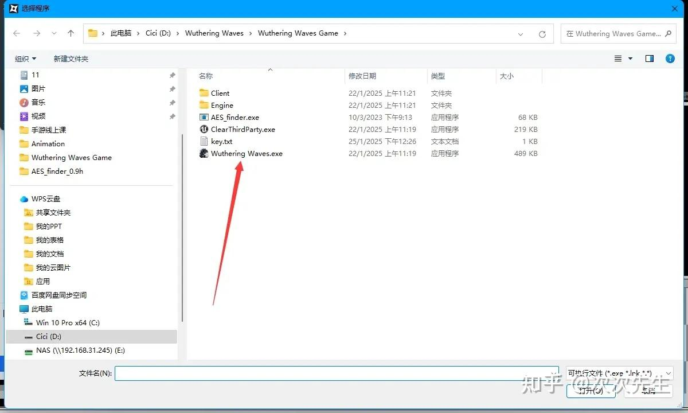
   
3.启动成功后左上角会有提示，按照对应的按键截取就好了.
   
     
4.点这个打开输出文件夹:
   
   
5.你会看到这样的 png 贴图和 nr 模型文件, 可以使用插件将 nr 模型导入到 Blender.
   
   
6.打开插件目录，将插件安装到 Blender 上就可以导入了.

---

## 2. Fmodel 解包场景模型文件，Umodel 解包角色动画文件

我们需要准备两个软件，一个是叫做 Fmodel，一个是 Umodel

链接：[https://pan.baidu.com/s/1pKGXX2Ml3gp_1jZwx_A4lA?pwd=3wsd](https://pan.baidu.com/s/1pKGXX2Ml3gp_1jZwx_A4lA?pwd=3wsd)

在讲解这两个软件之前，我想让大家了解一下一个叫做 AES 加密的概念：  
虚幻引擎在打包游戏的时候，厂商能够给打包的 pak 包进行加密，这是很正常的操作。  
AES 加密有一个很大的好处就是读取大文件的时候速度很快，但缺陷就是解密和加密都是用的同一个密钥，这样就给我这种小人钻了空子。

### Fmodel 的设置：
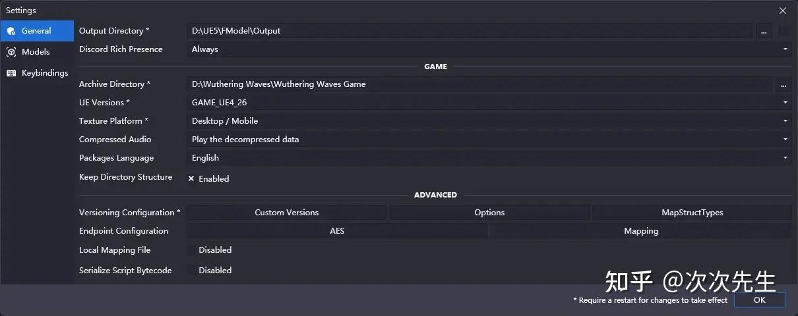  
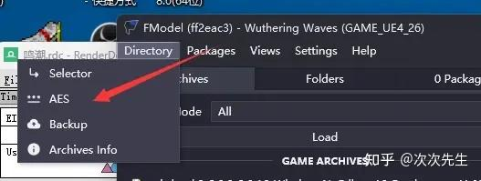  
- 我们需要在 AES 填写 pak 的密钥  
- 密钥获取网站：[https://cs.rin.ru/forum/viewtopic.php?f=10&t=100672](https://cs.rin.ru/forum/viewtopic.php?f=10&t=100672)

  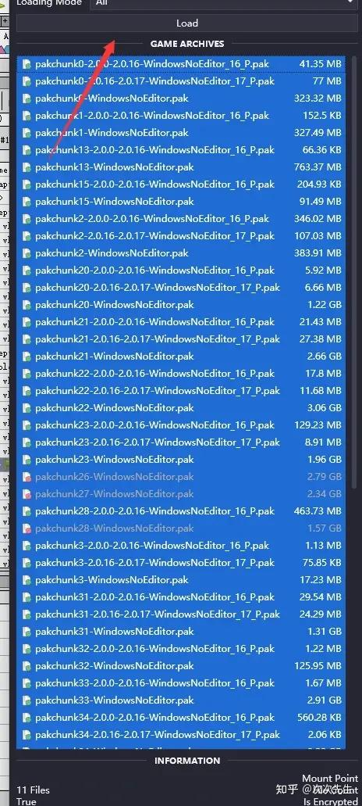  
- 全选文件后点击加载，
  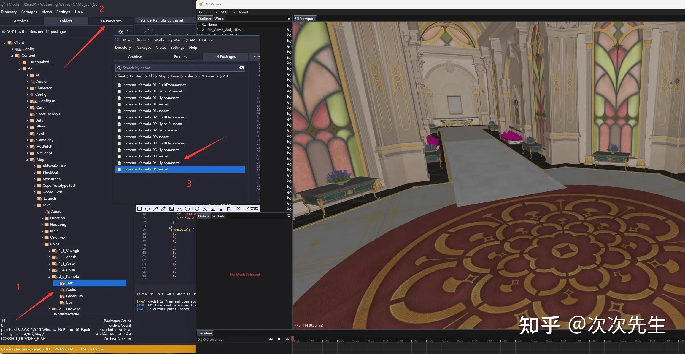
  
- 然后就可以点开地图看了
  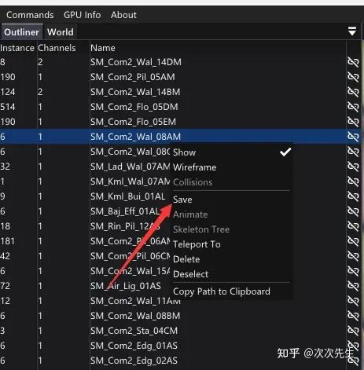  
- 将需要的模型 save，保存为 psk 文件.
  
- Blender 也有插件，能把 psk 文件编译导入进去
  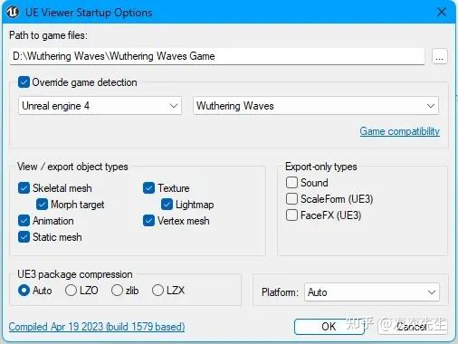
  
### Umodel 的设置：

- 填入 AES 密钥，
    
  和 Fmodel 是一样的
  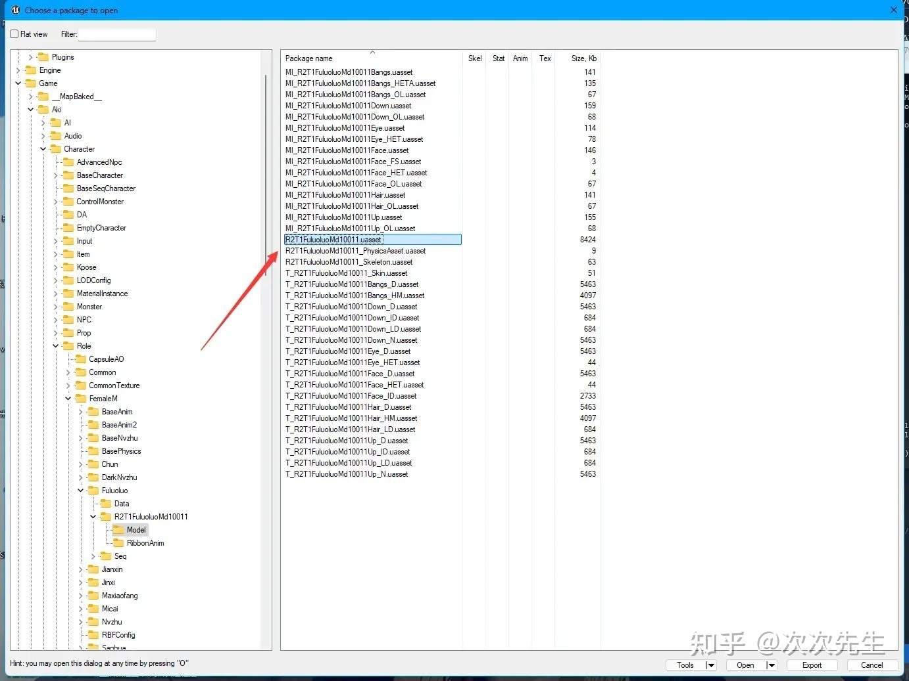  
- 打开角色
  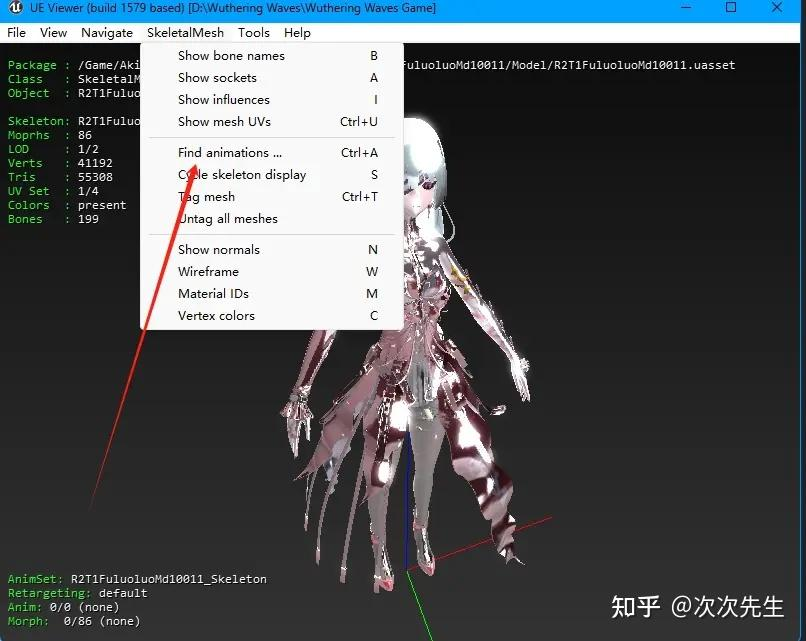
- 自动查找角色所使用的所有动画
   
- 然后就可以点 Tools > Export 导出了

---

## 3. RenderDoc 通过图形接口截帧查看渲染源码

无论库洛怎么隐藏，游戏始终是要调用图形接口的，所以我们用 RenderDoc 从图形接口去寻找渲染用的源码。

鸣潮 PC 端会扫后台，所以 PC 端会识别到 RenderDoc，好在 RenderDoc 是开源的，我们可以去 Git 上自己编译一个自定义的 RenderDoc，但是比较麻烦，所以这里我推荐使用**模拟器大法**。

1. 首先准备两个软件 RenderDoc 和 mumu 模拟器 12，两个软件百度都能下载到，我就不贴链接了  
2. 首先打开 mumu 模拟器 12，进行如下的设置
   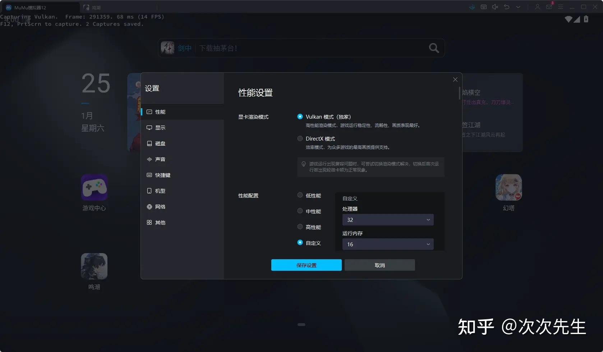    
3. 在 mumu 模拟器里安装好鸣潮，然后关闭模拟器  
4. RenderDoc 的操作：给 mumu 模拟器上 hook 钩子，通过模拟器绕过鸣潮的加密
     
5. 在 RenderDoc 里选择 mumu 模拟器的启动核心
   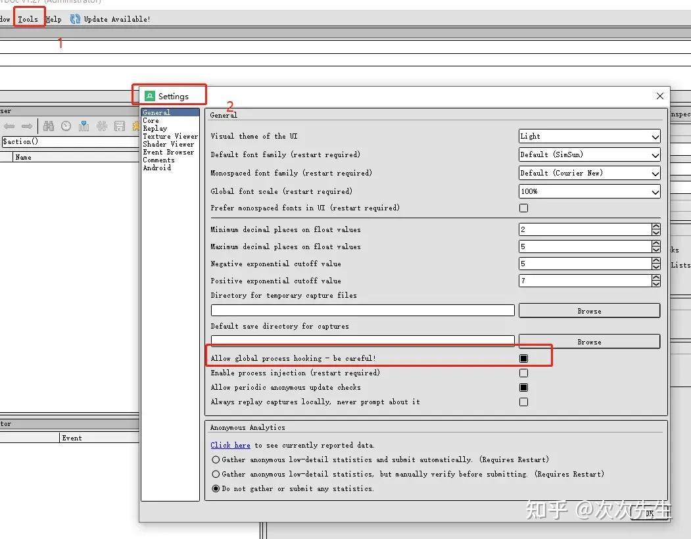  
6. 打开 RenderDoc 的全局 hook 功能（低配机警告）
     
7. 确认 hook 打开后，我们再次启动 mumu 模拟器
      
8. 出现调试界面表示我们 hook 成功了，接下来我们只需要启用钩子
    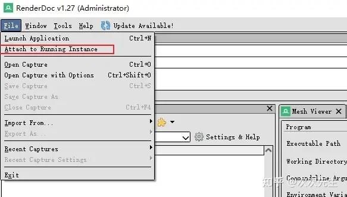
    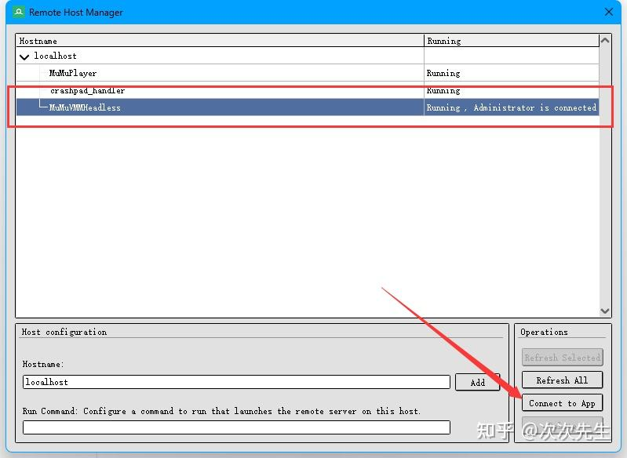  
9. 然后我们就能进行愉快地截帧了
    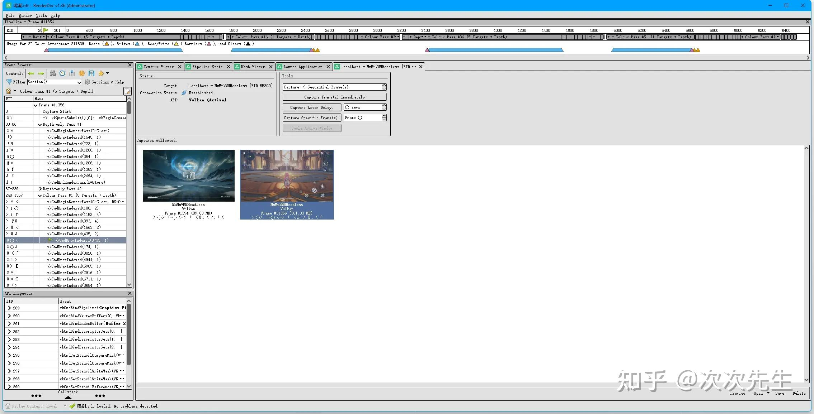  

---

> 编辑于 2025-02-12 17:49・重庆
